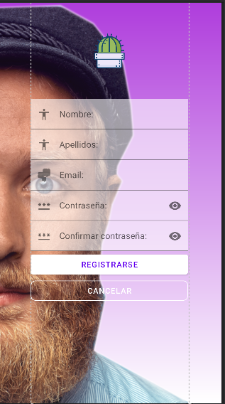

# Bienvenidos a mi README

> Este **repositorio** será usado para las distintas acciones  
> A continuación voy a presentar **mi proyecto** y su estructura:

*Esto es solo **una prueba** en la cual interactuo con el file
--Readme--*

### *Esta es la otra `ventana`,la cual **está comunicada** con la anterior imagen*

#### He creado otra ventana que está enlazada con la pantalla login,tiene una **barra superior** al igual que la de Register.

Y aquí podréis visitar mi perfil: [Kevin](https://github.com/Kevbast)
