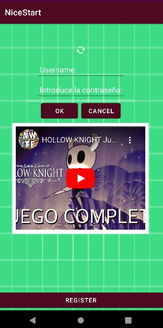

# Bienvenidos a mi README

> Este **repositorio** será usado para las distintas acciones  
> A continuación voy a presentar **mi proyecto** y su estructura:
#### *LOGIN*

>Como se puede ver he utilizado varias `herramientas` para decorar la *página*,he creado un **estilo graduable** el cual se utiliza como fondo.

#### *REGISTER*

>*Esta es la otra `ventana`,la cual **está comunicada** con la anterior imagen*.
> Se puede visualizar que tiene las **mismas característcas** o *parecidas* a la otra ventana.

#### *MAIN*

>He creado `otra ventana`  que está ~~enlazada~~ con la pantalla **login y register**,tiene una **barra superior** al igual que la de Register pero **sin la flecha** para volver hacia atrás.
>
> También he añadido un `iframe` con un enlace a un video de **youtube**.
>
>Se puede observar también que tiene un `layout land`,en el cual *modifiqué* para que se pueda ver **mejor posicionado**.
### *SPLASH*

> En esta imagen se puede observar una **nueva actividad** creada,la cual su única función es usarla como `pantalla de carga` en la *actividad Login*.
>
> La imagen esta implementada con `Guide` y `animada`.
### *NOPEOPLE*

>Esta es `otra página` creada para el uso de las `WEBVIEW` y el `SWIPEREFRESH`,cada vez que **se refresca** la *pantalla* se `*genera otra imagen*` distinta y **aparece un mensaje** creado;

Y aquí podréis visitar mi perfil: [Kevin](https://github.com/Kevbast)
