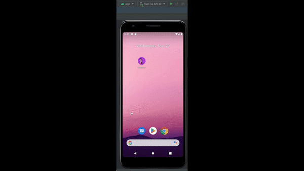

*<h1 align="center">Bienvenidos a mi ReadMe</h1>*

> Este **repositorio** será usado para las distintas acciones:
* Aprendizaje
* Estudio
```
> A continuación voy a presentar **mi proyecto** y su estructura:
```
#### *LOGIN*


>Como se puede ver he utilizado varias `herramientas` para decorar la *página*,he creado un **estilo graduable** el cual se utiliza como fondo.

#### *REGISTER*


>*Esta es la otra `ventana`,la cual **está comunicada** con la anterior imagen*.
> Se puede visualizar que tiene las **mismas característcas** o *parecidas* a la otra ventana.

#### *MAIN*

>He creado `otra ventana`  que está ~~enlazada~~ con la pantalla **login y register**,tiene una **barra superior** al igual que la de Register pero **sin la flecha** para volver hacia atrás.
>
> También he añadido un `iframe` con un enlace a un video de **youtube**.
>
>Se puede observar también que tiene un `layout land`,en el cual *modifiqué* para que se pueda ver **mejor posicionado**.
### *SPLASH*

> En esta imagen se puede observar una **nueva actividad** creada,la cual su única función es usarla como `pantalla de carga` en la *actividad Login*.
>
> La imagen está implementada con `Guide` y `animada`.
>Voy a enseñar alugnas de las funciones que tengo en mi código:
````
//Para cargar la imagen de fondo
        ImageView mMario=findViewById(R.id.galaxy);
        Glide.with(this).load("https://i.pinimg.com/originals/c6/3b/32/c63b32aacf8ec3df5fbc92125bc23056.jpg").centerCrop()
                .transition(DrawableTransitionOptions.withCrossFade(500))
//                .diskCacheStrategy(DiskCacheStrategy.ALL)
                .placeholder(new ColorDrawable(this.getResources().getColor(R.color.teal_200)))
                .into(mMario);
````
### *NOPEOPLE*


>Esta es `otra página` creada para el uso de las `WEBVIEW` y el `SWIPEREFRESH`,cada vez que **se refresca** la *pantalla* se `*genera otra imagen*` distinta y **aparece un mensaje** creado.
>
> *He añadido una `animación de lottie` usando un archivo **json***.

### Carga_Register

>*Por último he añadido otro activity el cual **está comunicado con los activities Login y Main**,esta ventana hace de comunicador simulando `una pantalla de carga` que te enlaza con la **ventana Register**.*
>
> *Se puede ver en la imagen que he implementado las funciones `guide` para que aparezca la imagen y he usado una **animación lottie**.*
>
> _Ahora voy a enseñar la **función** que he utilizado para `comunicar` las ventanas:_
>
  ```
  private void openApp(){
        Handler handler = new Handler();
        handler.postDelayed(new Runnable() {
            @Override
            public void run() {
                Intent intent = new Intent(Carga_Register.this, Register2.class);
                intent.addFlags(Intent.FLAG_ACTIVITY_NEW_TASK);
                intent.addFlags(Intent.FLAG_ACTIVITY_CLEAR_TASK);
                startActivity(intent);
            }
        },5000);
  ```
<!--[](https://github.com/anuragaghazra/github-readme-stats)-->

## Expresiones de Gratitud 🎁
* Comenta a otros sobre este proyecto 📢
* Tómate un café ☕.
* Da las gracias públicamente 🤓.
* etc.
---
⌨️ con ❤️ por  [Kevin](https://github.com/Kevbast)
